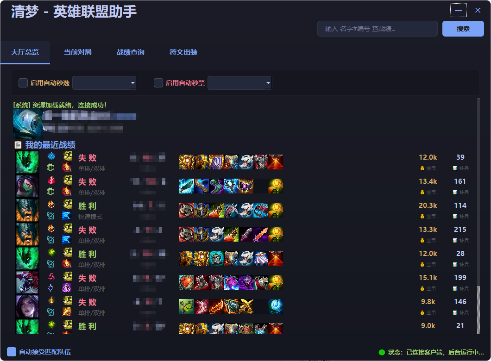
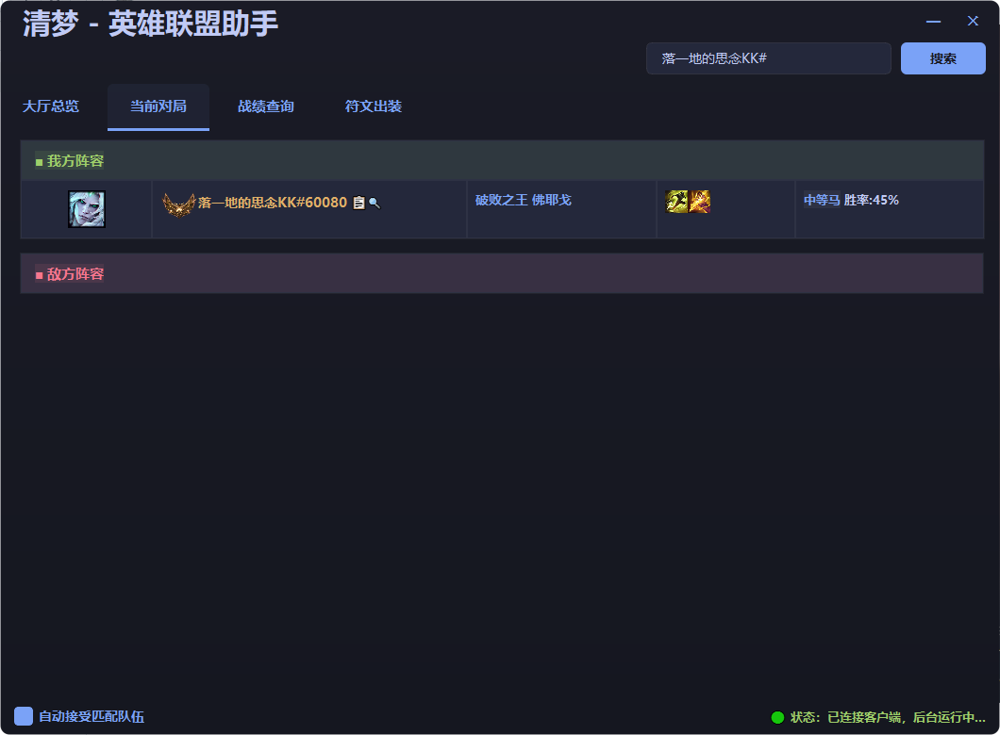
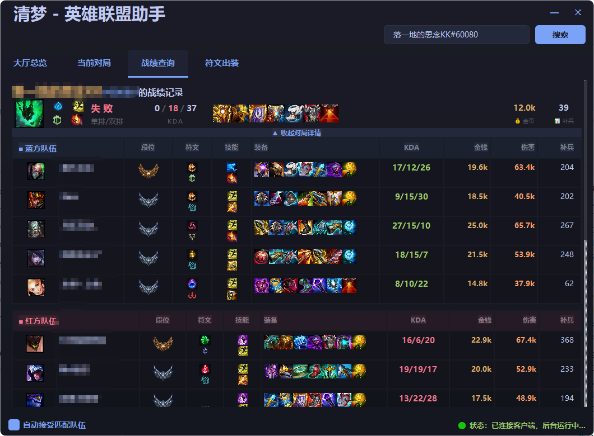
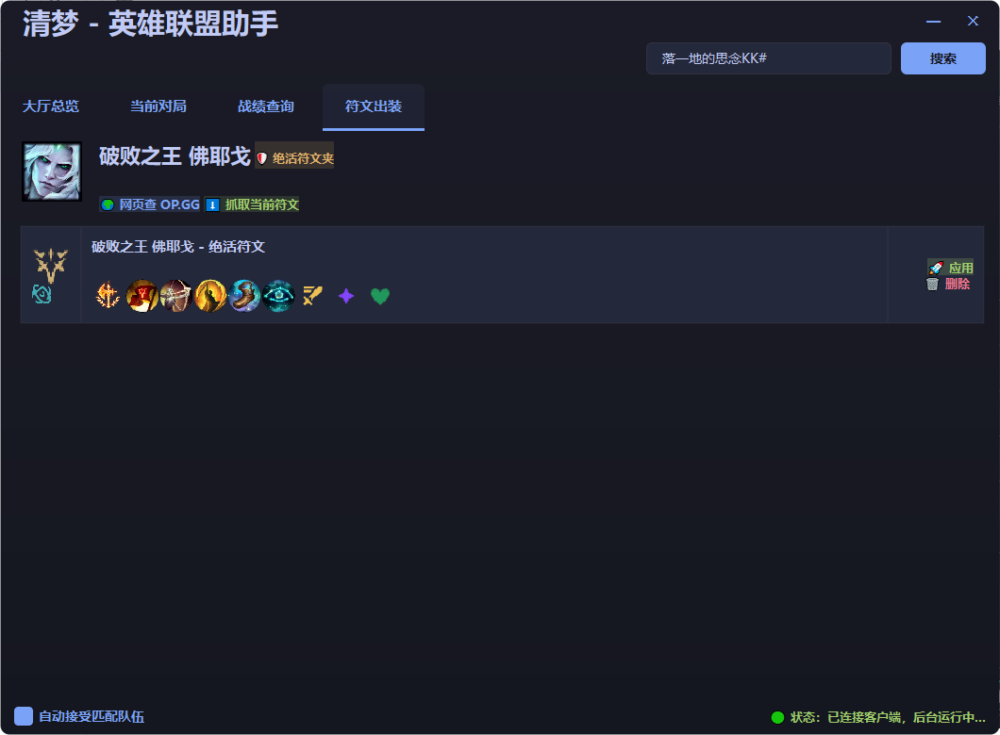

# 清梦 - 英雄联盟助手 V0.3

一个基于 LCU API 的简易英雄联盟助手，提供基本信息显示、对局自动确认、对局状态监测、双方战绩精准查询、**本地专属符文管理**以及精美的现代化图形界面

## 🔒 安全说明 

- 本软件为开源项目，所有源代码均可在此公开审查。部分杀毒软件或 Windows SmartScreen 可能会因软件较为小众而弹出风险提示，这是正常现象，**并非病毒**
- 若出现 SmartScreen 拦截，请点击 **“更多信息”** ，然后选择 **“仍要运行”** 即可
- 如有疑虑，欢迎自行从源代码进行构建运行

## ✨ 已实现功能

- ✅ **客户端状态监测**：实时显示账号基本信息（等级、经验值、头像）
- ✅ **对局自动化**：自动接受对局（可开关设定）
- ✅ **智能联动跳转**：根据客户端行为（进房间、选人、查战绩）自动跳转到对应功能标签页。
- ✅ **自动选择/禁用英雄**：可在选人阶段快人一步
- ✅ **全方位战绩查询**：
  - **队友/敌方检测**：选人阶段自动识别阵容，查询近期战绩（胜率、KDA、综合评分、段位、打分评价如 “ 上等马 ” ）
  - **主动精确查询**：支持输入“召唤师名字#编号”查询任意玩家战绩（含段位卡片、历史对局模式、KDA、装备出装展示）
- ✅ **专属符文管理系统**：
  - 支持一键抓取当前客户端搭配的符文配置
  - 支持将特定配置保存为某英雄的“xx符文”（可自己改名）
  - 支持一键将保存的符文应用写入游戏客户端
  - 快捷跳转 OP.GG 查看英雄数据。
- ✅ **现代化图形界面**：基于 PySide6 打造的深色模式 UI，结合官方游戏图标、装备图、符文图，数据一目了然

## 🐛 已知 Bug

- 客户端异常退出或杀进程后重启，可能会导致助手状态判断异常（显示为未连接）**解决方法：重启助手即可**

## 🎯 后续目标

- 进一步打磨和优化评分标准算法（降低评价门槛）
- 修复已知bug
- 完善出装推荐功能模块
- 优化代码结构与运行性能
- 优化图形界面<del>依旧画大饼这一块./</del>

## 📦 安装与使用

### 环境要求
- Windows 操作系统（需已启动并登录英雄联盟客户端）
- Python 3.8+（仅限源码运行用户）

### 方案一：简易食用方法

1. 在仓库右侧的 [Releases] 页面下载最新版的 `清梦助手.zip` 压缩包
2. 将压缩包解压到一个文件夹中
3. **【⚠️ 重要提醒】请确保解压后的 `data` 文件夹与 `清梦助手.exe` 处于同一目录下！** 否则程序将无法读取本地中文数据，会默认从拳头官方获取英文版本映射表
4. 启动英雄联盟客户端，双击运行 `清梦助手.exe` 即可食用

### 方案二：从源码运行

1.克隆本仓库

   ```bash
   git clone https://github.com/sxcrazy/qingmenghelper.git
   cd qingmenghelper
   ```

2.安装依赖
   ```bash
   pip install lcu-driver

   pip install PySide6
   ```

3.运行
   ```bash
   python gui_new2.py
   ```

## 📝 更新日志

### V0.3
- **段位展示**：战绩查询新增双栏卡片式段位展示（单排/灵活排），带段位图标、LP、胜负场次、胜率条，终于不用猜对面是什么马了
- **UI 打磨**：Tab 标签加大、搜索栏加宽、底部栏微调，整体更舒服一点，<del>虽然改动不大但 commit 挺多的</del>
- **QSS 大扫除**：清理了一堆 Qt 不支持的 CSS 属性（`qlineargradient`、`transition`、`outline`、SVG data URL 等），彻底告别 "Could not parse stylesheet" 的灵魂拷问
- **Bug 修复**：修复了段位信息被战绩列表覆盖的 Bug，现在段位和战绩能和平共处了
- **代码清理**：移除了编辑残留的死代码、修复了玩家名尾部空格问题
- <del>版本号从 0.2 直接跳到 0.3，不是因为功能多，是因为 bug 修得多，四舍五入也算更新了吧</del>

### V0.2
- **战绩增强**：对局行整行可点击展开 → 查看完整 10 人阵容、装备、KDA、经济、伤害、补兵
- &nbsp;
- **新增功能**：自动选择/禁用英雄
&nbsp;
- **主页升级**：新增自己的最近 10 场战绩速览
&nbsp;
- **UI 重设计**：去表格化紧凑卡片布局、图标大幅放大、暗色渐变背景、胶囊标签，删去出装推荐栏
&nbsp;
- **图标完善**：新增召唤师技能图标从 Data Dragon 自动下载、段位徽章放大至 40+ px
&nbsp;
- **代码重构**：抽取公共函数、修复全部裸露 except、移除死代码、新增战绩缓存与 toggle 状态管理
&nbsp;
- **打包适配**：data 目录路径 fallback 兼容新版 PyInstaller

### V0.1 
- 新增模块：全新上线“符文建议”功能，支持抓取、保存、一键应用英雄专属本地符文
- UI升级：深度优化战绩查询页面，新增英雄头像、装备图标、召唤师技能图标的直观展示
- 符文装备推荐🔗：新增特定英雄的 OP.GG 网页一键直达功能（opgg 的CloudFlare实在太强，完全没法爬数据，其他网站数据也不好抓，不然就是过时，如有解决办法欢迎contribitution提供解决方法）
- 底层修复：重写了本地数据（data 文件夹）的绝对路径读取逻辑，彻底解决打包为 exe 后部分数据变为英文的 Bug
- 修复若干bug
- <del>别问为什么没有0.7、8、9了，抵制挤牙膏从你我做起</del>

### Beta 0.5 & 0.5.1
- 优化了战绩查询系统，现已支持显示玩家段位和编号（清梦大帅哥#1234）
- 现在娱乐模式战绩将计入位评分体系中(考虑到现在娱乐模式玩家不少，如果排除可能会导致无法比较)
- 修复了训练营选人退出导致阶段判断异常的问题
- 修复了部分娱乐模式名称显示异常的问题（已适配斗魂竞技场与海克斯大乱斗）
- 修复若干bug
  
### Beta 0.4
- 划分了主页、对战信息、战绩查询等不同的功能区
- 加入“自动跳转”逻辑，触发游戏内相应行为时，助手会自动切换到对应的页面
- 进一步优化图形界面，修复若干 Bug
- 优化并迭代了第三版评分标准，现在娱乐模式战绩将不再计入排位评分体系中
  
### Beta 0.3
- 迎来重大重构，图形化界面框架由 Tkinter 升级更换为更现代的 PySide6
- 新增主动查询他人战绩功能
- 自动接受对局功能现已支持手动开启/关闭
- 优化代码逻辑，提升程序容错率
- 修复若干bug
  
### Beta 0.2
- 首次加入自动接受对局功能（无法关闭）
- 优化早期代码，修复已知 Bug
  

## 界面预览
### 主页显示

### 对战信息显示

### 战绩查询页面

### 符文出装管理页面



